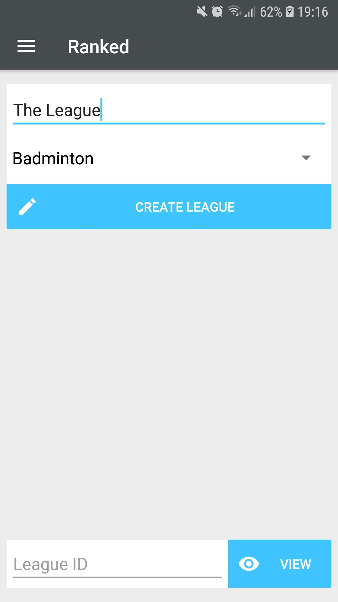
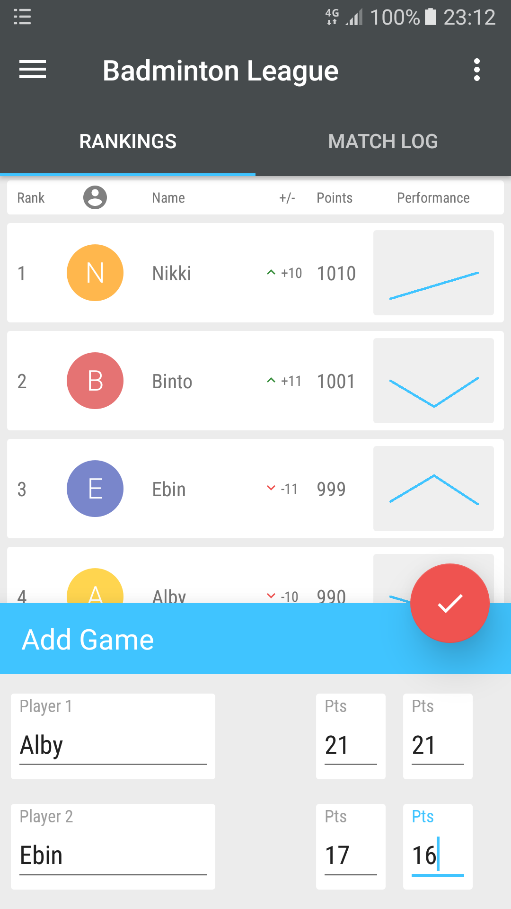
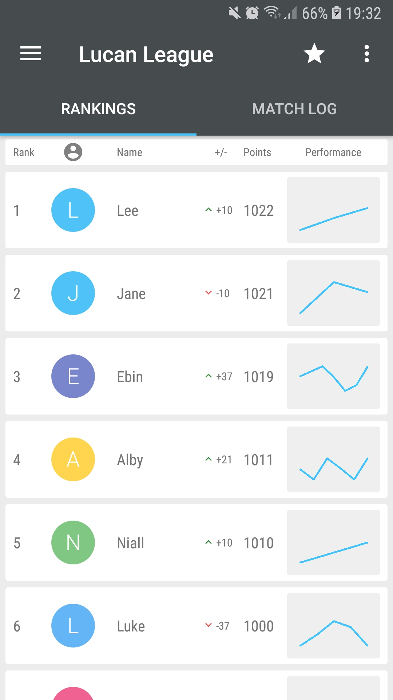
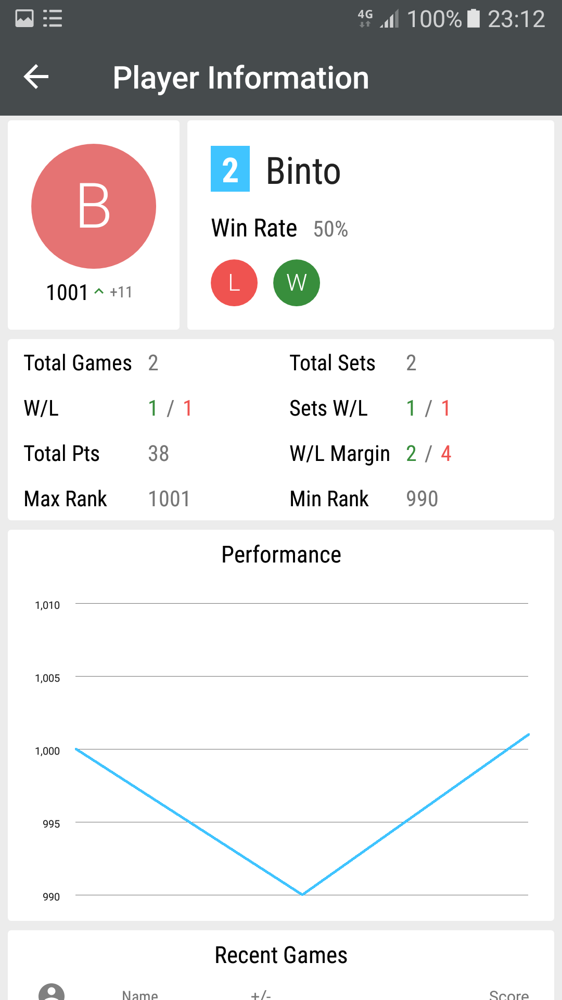
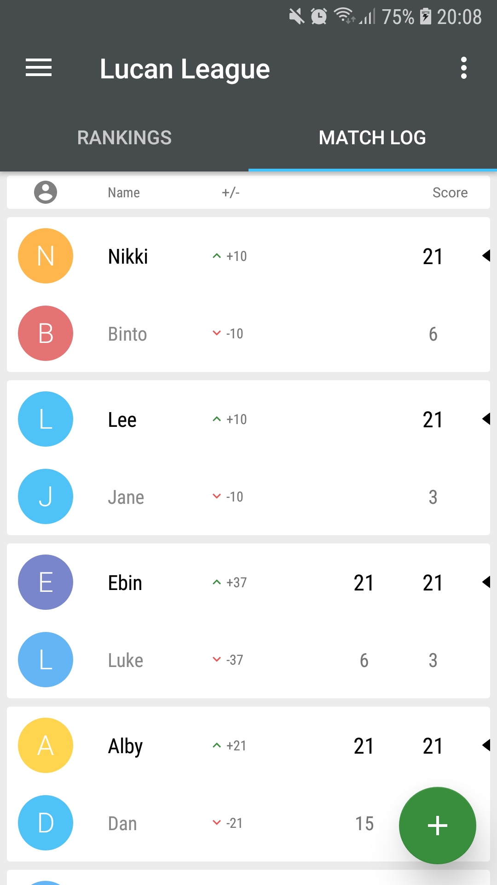
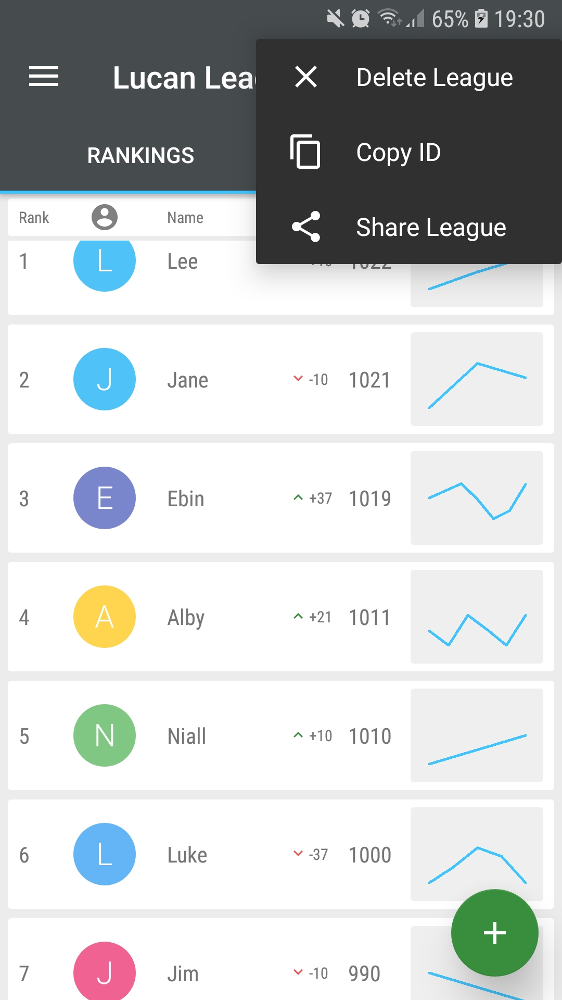
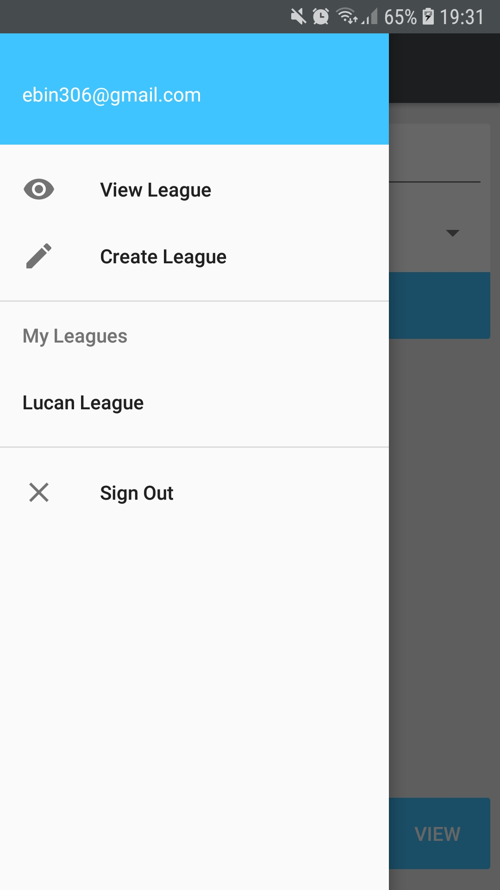

# Ranking-Badminton
An Android app to keep track of game records and rankings in badminton leagues. League information is stored on Google Firebase which allows easy sharing of leagues.

# What it does

 <table style="width:100%">
  <tr>
    <th>Allows users to create Badminton Leagues.</th>
    <th>Allows the addition of match information.</th>
  </tr>
  <tr>
    <td></td>
    <td></td>
  </tr>
</table> 

 <table style="width:100%">
  <tr>
    <th>Keeps track of player rankings.</th>
    <th>Allows players to check their performance.</th>
  </tr>
  <tr>
    <td></td>
    <td></td>
  </tr>
</table> 

<table style="width:100%">
  <tr>
    <th>Shows the match log of league games.</th>
    <th>Allows mistakes to be corrected.</th>
  </tr>
  <tr>
    <td></td>
    <td></td>
  </tr>
</table>

<table style="width:100%">
  <tr>
    <th>Allows users to share the league.</th>
    <th>Has a useful sidebar with all your leagues.</th>
  </tr>
  <tr>
    <td></td>
    <td></td>
  </tr>
</table> 

# Other Info

* The rank change in the event of a win/loss is calculated based on the difference in rank between the winner and the loser.
* When a game is deleted or edited, rank changes in subsequent matches will change based on the result of the edited/deleted match.

